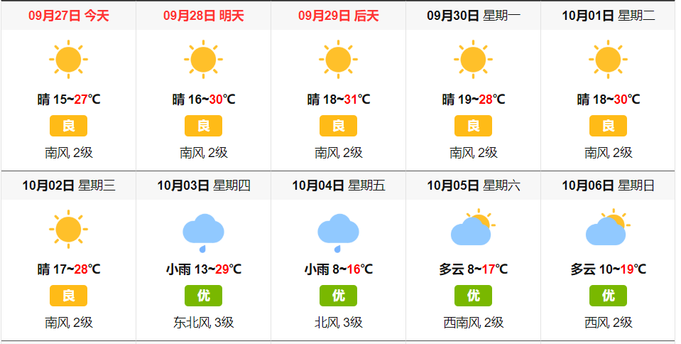

# 国庆订婚大作战
## 章节一：行程安排
### 10月1号
##### 到达:
```
景涛大家族
	12:00 到 北京西站

杨媛大家族
	15:30 到 北京南站
```
			
##### 晚上：
```
18.30 - 19.30
	吃饭。

19.30 - 
	休息，电视观看国庆阅兵。
```
	

### 10月2号
##### 上午：
```
无安排，熟悉环境。
```

##### 中午：
```
11.30 - 13.30
	正式餐，商量结婚事宜等。
	地点：大鸭梨。（品尝地道的北京烤鸭）
```
			
##### 下午：
```
14.00 - 14.40
	做地铁到奥利匹克公园。

15.00 - 16.00 
	中国科技馆，球幕影院，体验球幕电影。

16.20 - 18.00
	游奥林匹克森林公园。
```
			
#### 晚上：
```			
18.30 - 19.30
	天虹商场，吃饭。

20.00 - 21.30
	夜游水立方，鸟巢，观看夜景。

21.30 - 22.15
	地铁回家.
```
	
### 10月3号
##### 06.30 -  16.30
```
选择一：世界园艺博览会。
选择二：长城。
待定？!!!!
```
		
##### 晚上：
```
17.00 - 18.30 
	休息，吃饭。（平时餐）

19.00 - 20.00
	做地铁到天安门广场。

20.00 - 21.30
	观看天安门夜景和景山公园

21.30 - 22.30
	做地铁回家。
```
	
	
### 10月4号
##### 06.30 - 16.30
```
杨媛老爸早上8.00坐车回家。
由于部分景点已有人去过，因此选择性分批自由活动, 可以按照以下路线自行游玩:
*  路线一 ：升旗-毛主席纪念堂-天安门广场-故宫博物院-天坛-颐和园
*  路线二 ：动物园-动物园海底世界-颐和园
* ...
```
	
##### 晚上：
```
吃完饭，可以全体泡温泉。
或者是女性去做脸。
夜骑自行车体验第一条自行车道。
什刹海，南锣鼓巷，三里屯等。。。
```

	
### 10月5号
##### 上午
```
睡到自然醒 返回温馨得家。
```


## 章节二：衣、食、住、行

##### 住宿-民宿

| 小区        | 户型       | 大小    | 距地铁距离 |
| :-----      | :-----    | :-----  | :-----   |    
| 旭辉奥都    | 2室1厅1卫  | 90平米  | 7分钟
| 领地OFFICE  | 2室1厅1卫  | 114平米 | 5分钟

（说明：2个房间不在一起，但是很近，走路最多10分钟。）


##### 出行
```
* 地铁： 下载易通行APP， 刷二维码  
* 公交： 下载北京公交APP， 刷二维码  
* 现金： 建议每个人随身携带200元现金，以及零钱。   
```

##### 吃饭
```
* 吃饭：  
* 酒：低度数北京产牛栏山。  
```

##### 穿衣
```
出发前，看天气，而定。
```

##### 天气
带上一个短袖 & 外套。
如果3号爬长城，是非常冷的。

